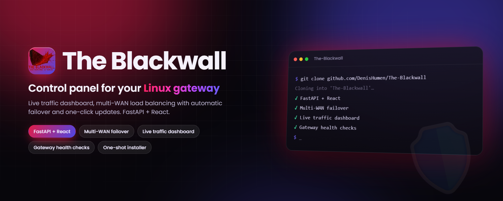
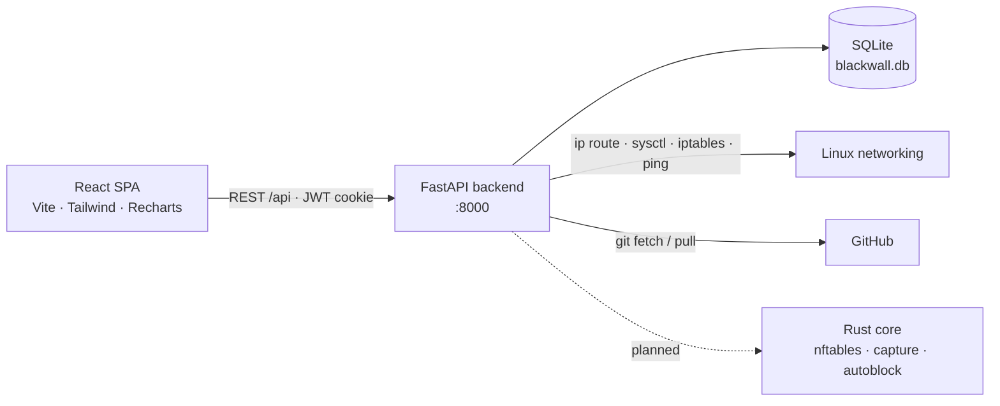

<div align="center">



# The Blackwall

**A self-hosted web control panel for a Linux network gateway: live system and traffic monitoring, multi-uplink load balancing with automatic failover, and one-click updates. Stay protected, netrunner.**

[](backend/requirements.txt)
[](backend/app/main.py)
[](frontend/package.json)
[](#-quick-start)
[](LICENSE)
[](https://github.com/DenisHumen/The-Blackwall/commits/main)

**English** · [Русский](README.ru.md)

[Features](#-features) · [Quick start](#-quick-start) · [Usage](#-usage) · [Architecture](#-tech-stack--architecture) · [Roadmap](#-roadmap)

</div>

---

The Blackwall turns a Linux box into a managed network gateway. A FastAPI backend and a React dashboard let you watch CPU, memory, disk and network throughput in real time, and route your LAN's traffic through several upstream gateways, either spread across them by weight (round-robin) or switched automatically to a backup when the primary goes down (failover). It is built for home labs and small offices that want a web UI instead of hand-editing `ip route` and `iptables`.

> [!NOTE]
> **Early-stage project.** The dashboard, authentication, load balancer and updater work today. The firewall engine (nftables management, packet capture, auto-blocking, GeoIP) is still being designed: `rust-core/` holds the module skeleton only, and the Docker, nginx and SQL schema files are empty placeholders. See the [Roadmap](#-roadmap).

<div align="center">
  
</div>

## ✨ Features

| | |
|---|---|
| 🔐 **Secure sign-in** | First launch asks you to create the `root` account. Passwords are hashed with bcrypt (8+ characters), sessions use a JWT in an `httpOnly` cookie, and login is rate-limited to 5 attempts per minute per IP. |
| 📊 **Live dashboard** | CPU, RAM, disk, uptime, load average and network RX/TX, refreshed every 3 s. Rates scale automatically (B/s → KB/s → MB/s → GB/s). Reads `/proc` on Linux and falls back gracefully on other OSes. |
| 📈 **Traffic history** | RX/TX chart for the last 1 h, 24 h, 7 d or 30 d. Points are stored in the database, downsampled to ≤ 500 per request and pruned after 31 days. |
| 🔀 **Load balancer: round-robin** | Multipath default route (`ip route … nexthop … weight N`) across every healthy upstream gateway, with NAT masquerade. |
| 🛟 **Load balancer: failover** | Primary and backup gateways ordered by priority; the default route switches as soon as the active one fails its health checks. The switch count and last switch time are tracked. |
| 🩺 **Health checks** | Each gateway is pinged, then a check target (default `8.8.8.8`) is pinged *through* it via a temporary `/32` route. Interval, timeout and failure threshold are set per configuration. |
| 🧷 **Safe routing** | Saves the original default route, pins `/32` host routes to upstream gateways so the node never loses them, disables ICMP redirects for single-NIC setups, and restores everything on deactivation. Every command runs without a shell, with validated arguments. |
| 🧪 **Virtual gateway IP** | Optionally creates a `dummy` interface (e.g. `lb0` with `10.10.10.1/24`) that LAN clients use as their default gateway. |
| 🔄 **Built-in updater** | Checks GitHub for new tags or commits, backs up local data (DB, secret key, `.env`), runs `git pull`, reinstalls dependencies and rebuilds the frontend, with rollback from the UI. |
| 🧰 **Unified launcher** | `python main.py` offers an interactive menu or subcommands for status checks, dev servers, tests, builds, updates and systemd control. |
| 🐧 **One-shot installer** | `scripts/install.sh` sets up Ubuntu 22.04+ / Debian 12+ end to end and repairs a broken install when run again. |
| 🧾 **Rules & logs API** | CRUD API for firewall rules (stored in the database, not yet applied to nftables) and a filtered log feed for the dashboard. |

## 🚀 Quick start

### Prerequisites

- **Python 3.10+** and **pip**
- **Node.js 18+** and **npm** (to build the web UI)
- *Optional:* Rust / Cargo (the launcher builds `rust-core/` when Cargo is present)
- **Linux** for the real networking features. On macOS and Windows the load balancer runs in simulation mode and only logs what it would do.

### Local run (development)

```bash
git clone https://github.com/DenisHumen/The-Blackwall.git
cd The-Blackwall
python3 -m venv .venv && source .venv/bin/activate

# All in one: installs deps, builds Rust core (if Cargo exists), inits the DB,
# runs the tests, then starts the backend (:8000) and the Vite dev server (:5173)
python main.py quickstart
```

Or step by step:

```bash
pip install -r backend/requirements.txt
(cd frontend && npm install && npm run build)
cd backend && python -m uvicorn app.main:app --reload
```

Open **http://localhost:8000**. On the first visit you will be asked to create the `root` user. The API docs live at **/docs** (Swagger UI) and **/redoc**.

> When `frontend/dist` exists, the backend serves the built SPA itself. For frontend work, run `python main.py frontend` (Vite on **:5173**, proxying `/api` to `:8000`).

### Production install (Ubuntu 22.04+ / Debian 12+)

```bash
git clone https://github.com/DenisHumen/The-Blackwall.git
cd The-Blackwall
sudo bash scripts/install.sh
```

The installer is idempotent: run it again to check and repair an installation. It works in place (the clone *is* the installation) and:

1. installs system packages (`python3-venv`, `iproute2`, `iptables`, `nftables`, `iputils-ping`, …) and loads the `dummy` kernel module on boot;
2. installs Node.js 20 if Node 18+ is missing, plus Rust via rustup (optional);
3. creates `backend/venv` and installs the Python dependencies;
4. builds the frontend (`frontend/dist`) and the Rust core;
5. generates `backend/.secret_key` and initializes the SQLite database;
6. creates the `blackwall` system user, **gives it ownership of the project directory**, installs the systemd units and starts `blackwall-backend`.

Then open `http://<server-ip>:8000` and create the `root` user. The install log goes to `/tmp/blackwall-install.log`.

## ⚙️ Configuration

The backend reads environment variables with the `BLACKWALL_` prefix (via pydantic-settings; `.env` files are not loaded automatically, so set them in your shell or the systemd unit):

| Variable | Default | Description |
|---|---|---|
| `BLACKWALL_SECRET_KEY` | auto-generated | JWT signing key. If empty, a random key is created once and stored in `backend/.secret_key` (mode `0600`). |
| `BLACKWALL_JWT_ALGORITHM` | `HS256` | JWT algorithm. |
| `BLACKWALL_JWT_EXPIRE_HOURS` | `24` | Token lifetime (the session cookie itself expires after 24 h). |
| `BLACKWALL_DB_URL` | `sqlite+aiosqlite:///…/backend/blackwall.db` | SQLAlchemy async database URL. |
| `BLACKWALL_CORS_ORIGINS` | `["http://localhost:5173"]` | Allowed CORS origins (JSON list). |
| `BLACKWALL_TESTING` | `false` | Test mode: skips re-activating balancers on startup. |

Each load-balancer configuration is edited in the UI and stored in the database:

| Setting | Default | Meaning |
|---|---|---|
| Mode | `round_robin` | `round_robin` (weights) or `failover` (primary + backups by priority) |
| Check interval | `5` s | Time between health-check rounds |
| Check target | `8.8.8.8` | Host pinged through each gateway to confirm internet access |
| Check timeout | `2.0` s | Ping timeout |
| Failures before switch | `3` | Consecutive failures before a gateway is marked down |
| Virtual interface | off | Optional `dummy` interface + CIDR (UI suggests `lb0` / `10.10.10.1/24`) |
| Gateway interface | auto | Detected with `ip route get <gateway>` when left empty |

Local data kept across updates: `backend/blackwall.db`, `backend/.secret_key`, `backend/.env`, `.env`, `config/local/`, `data/`. Backups go to `backups/`.

## 🧭 Usage

### Web UI

| Page | What it does |
|---|---|
| **Login** | Sign in, or create the first `root` account on a fresh install |
| **Dashboard** | System health banner, CPU / RAM / disk gauges, network throughput, traffic chart (1h / 24h / 7d / 30d), firewall counters, recent activity |
| **Load Balancer** | Create round-robin or failover configs, add or remove gateways, run a health check, activate or deactivate, view live gateway status and latency |
| **Update** | Check for updates, read the changelog, apply with progress, roll back to a backup |

The interface is currently in Russian.

### Launcher (`main.py`)

Run `python main.py` with no arguments for the interactive menu, or pass a command:

| Command | Description |
|---|---|
| `info` / `status` / `check` | Project overview · component and dependency status |
| `backend [--host H] [--port P]` | FastAPI with auto-reload (default `0.0.0.0:8000`) |
| `frontend` | Vite dev server on `:5173` (installs npm deps if needed) |
| `fullstack` | Backend and frontend together |
| `quickstart` | Install deps, build, init DB, run tests, then `fullstack` |
| `test [path] [-q]` | Run the pytest suite |
| `db-init` | Create database tables |
| `setup-user` | Create a `root` user from the terminal (currently also expects the `passlib` package: `pip install passlib`) |
| `install-deps` | `pip install -r backend/requirements.txt` |
| `build-frontend` / `build-rust` | Production builds |
| `api-docs` | Open Swagger UI in the browser |
| `update` | Fetch, back up, `git pull --ff-only`, reinstall and rebuild |
| `service status\|start\|stop\|restart\|logs` | Control `blackwall-backend` via systemd (Linux) |
| `alembic <args>` | Run Alembic (install `alembic` separately) |
| `docs` | List the docs and preview the README |

### How the load balancer changes the host

When a configuration is activated on Linux, the backend:

1. enables `net.ipv4.ip_forward` and turns off ICMP redirects (`send_redirects` / `accept_redirects`);
2. saves the current default route and adds `/32` host routes to upstream gateways that are not directly connected;
3. replaces the default route: a weighted multipath route (round-robin) or a single `via` route (failover);
4. adds `iptables -t nat … MASQUERADE` for the outgoing interface(s);
5. re-checks gateway health in a loop and re-applies routes when a gateway goes down or recovers.

Deactivating restores the saved default route and ICMP redirects, removes the host routes and deletes the NAT rules. Active configurations are re-applied when the backend starts.

> [!WARNING]
> This rewrites the host's routing table and NAT rules. Run it on a dedicated gateway host or VM with console access. Deactivation deletes **every** `MASQUERADE` rule in the `nat/POSTROUTING` chain, including ones not created by The Blackwall. The systemd unit grants only `CAP_NET_ADMIN` and `CAP_NET_RAW`.

<details>
<summary><b>REST API reference</b></summary>

Every endpoint except `setup-check`, `setup`, `login` and `logout` requires the `access_token` cookie. The full schema is available at `/docs`.

| Method | Path | Description |
|---|---|---|
| GET | `/api/auth/setup-check` | `{"needs_setup": bool}`: whether a first user must be created |
| POST | `/api/auth/setup` | Create the first `root` user (works once) |
| POST | `/api/auth/login` | Sign in and set the cookie (5 attempts / 60 s per IP) |
| POST | `/api/auth/logout` | Clear the cookie |
| GET | `/api/auth/me` | Current user |
| GET | `/api/metrics/current` | Current system metrics (also stores a traffic point) |
| GET | `/api/metrics/traffic?range=1h` | Traffic history: `1h`, `24h`, `7d`, `30d` |
| GET | `/api/loadbalancer` | List configurations |
| POST | `/api/loadbalancer` | Create a configuration |
| GET | `/api/loadbalancer/{id}` | Get a configuration |
| PATCH | `/api/loadbalancer/{id}` | Update it; `is_active` activates or deactivates |
| DELETE | `/api/loadbalancer/{id}` | Delete (deactivates first) |
| GET | `/api/loadbalancer/{id}/status` | Runtime status |
| POST | `/api/loadbalancer/{id}/gateways` | Add a gateway |
| DELETE | `/api/loadbalancer/{id}/gateways/{gateway_id}` | Remove a gateway |
| POST | `/api/loadbalancer/{id}/health-check` | Run a health check now |
| GET | `/api/rules/stats` | Rule counters for the dashboard |
| GET · POST | `/api/rules` | List (`skip`, `limit`) · create (`action`: accept/drop/reject, `direction`: in/out/forward) |
| GET · PATCH · DELETE | `/api/rules/{id}` | Read · update · delete (system rules are protected) |
| GET | `/api/logs/recent?limit=8` | Recent activity feed |
| GET | `/api/logs` | Logs, filterable by `action` or `source_ip` (`limit` ≤ 500) |
| GET | `/api/updater/check` | Check GitHub for a newer version |
| POST | `/api/updater/apply` | Apply the update (`root` only) |
| POST | `/api/updater/rollback` | Roll back (`root` only) |
| GET | `/api/updater/progress` | Update progress |
| GET | `/api/updater/backups` | List backups |

</details>

### Running tests

```bash
python main.py test
# or
cd backend
PYTEST_DISABLE_PLUGIN_AUTOLOAD=1 python -m pytest -p anyio -p asyncio tests/ -v
```

The suite covers authentication and the API routes (`backend/tests/`).

## 🧱 Tech stack / Architecture

- **Backend:** Python, FastAPI, SQLAlchemy 2 (async), aiosqlite, Pydantic v2 + pydantic-settings, python-jose (JWT), bcrypt, Uvicorn
- **Frontend:** React 18, TypeScript, Vite 6, Tailwind CSS 3, Recharts, Zustand, React Router 6, Framer Motion
- **Networking:** iproute2 (`ip route`, `ip link`), `sysctl`, `iptables` NAT, `ping`
- **Database:** SQLite by default (`BLACKWALL_DB_URL` accepts any SQLAlchemy async URL); PostgreSQL + TimescaleDB is the planned production target
- **Rust core** (`firewall-core`): planned high-performance engine; module layout only for now
- **Ops:** systemd unit with capability-based hardening, idempotent Bash installer, git-based updater



## 📁 Project structure

```text
The-Blackwall/
├── main.py              # Unified launcher: interactive menu + CLI commands
├── backend/             # FastAPI application
│   ├── app/api/         # Routers: auth, metrics, loadbalancer, rules, logs, updater
│   ├── app/core/        # Auth, metrics collector, load-balancer engine, updater
│   ├── app/models/      # SQLAlchemy models
│   ├── app/schemas/     # Pydantic schemas
│   ├── app/crud/        # Data access helpers
│   └── tests/           # pytest suite
├── frontend/            # React + Vite SPA (Login, Dashboard, LoadBalancer, Update)
├── rust-core/           # Rust crate skeleton: nftables, traffic, autoblock, geoip, bindings
├── scripts/install.sh   # Installer for Ubuntu / Debian (other scripts are placeholders)
├── config/systemd/      # blackwall-backend.service (+ monitor unit, not used yet)
├── config/, database/, docker/  # Placeholders for nginx, logrotate, SQL schema, Docker
├── docs/                # API notes and design docs
├── plan/                # Project plans and timelines
├── todo.md              # Full architecture plan and roadmap
└── assets/images/       # Logo and artwork
```

## 🗺 Roadmap

Taken from [`todo.md`](todo.md) and [`plan/`](plan/):

- [x] Authentication with first-run setup
- [x] Real-time system and traffic dashboard
- [x] Round-robin and failover load balancer with health checks
- [x] In-app updater with backup and rollback
- [ ] Rust core: nftables management, packet capture, auto-blocking (brute force, port scans, DDoS), GeoIP
- [ ] Firewall rules applied to nftables; blocked IPs, logs and analytics pages
- [ ] WebSocket live updates, audit log, user management with roles
- [ ] PostgreSQL + TimescaleDB storage, Docker deployment, nginx reverse proxy with TLS
- [ ] Virtual stacking of nodes (master / slave) over a physical SFP port to share the load
- [ ] Later: threat-intelligence feeds (AbuseIPDB, Shodan), email / SMS / Telegram alerts, Grafana export, WireGuard, multi-node HA, Suricata IDS/IPS, QoS, VLAN

## 🤝 Contributing

Issues and pull requests are welcome. Please run the test suite before opening a PR, and describe any change that touches routing or NAT behaviour in detail.

## 📄 License

Released under the [MIT License](LICENSE).
