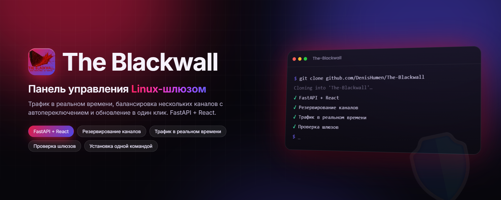
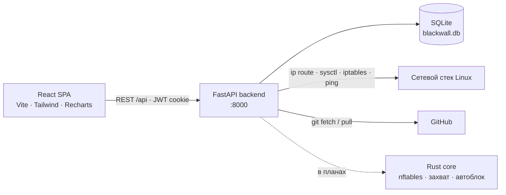

<div align="center">



# The Blackwall

**Самостоятельно размещаемая веб-панель для Linux-шлюза: мониторинг системы и трафика в реальном времени, балансировка между несколькими провайдерами с автоматическим переключением и обновление в один клик. Stay protected, netrunner.**

[](backend/requirements.txt)
[](backend/app/main.py)
[](frontend/package.json)
[](#-быстрый-старт)
[](LICENSE)
[](https://github.com/DenisHumen/The-Blackwall/commits/main)

[English](README.md) · **Русский**

[Возможности](#-возможности) · [Быстрый старт](#-быстрый-старт) · [Использование](#-использование) · [Архитектура](#-стек-и-архитектура) · [Планы](#-планы)

</div>

---

The Blackwall превращает Linux-машину в управляемый сетевой шлюз. Бэкенд на FastAPI и дашборд на React показывают загрузку CPU, памяти, диска и сетевой трафик в реальном времени и позволяют пустить трафик локальной сети через несколько вышестоящих шлюзов: распределять его по весам (round-robin) или автоматически уходить на резервный канал, когда основной падает (failover). Проект рассчитан на домашние лаборатории и небольшие офисы, которым нужен веб-интерфейс вместо ручной правки `ip route` и `iptables`.

> [!NOTE]
> **Проект на ранней стадии.** Уже работают дашборд, аутентификация, балансировщик и система обновлений. Движок межсетевого экрана (управление nftables, захват пакетов, автоблокировка, GeoIP) пока проектируется: в `rust-core/` лежит только каркас модулей, а файлы Docker, nginx и SQL-схем пустые. Подробнее в разделе [Планы](#-планы).

<div align="center">
  
</div>

## ✨ Возможности

| | |
|---|---|
| 🔐 **Безопасный вход** | При первом запуске система предлагает создать пользователя `root`. Пароли хешируются bcrypt (минимум 8 символов), сессия хранится в JWT в `httpOnly`-cookie, вход ограничен 5 попытками в минуту с одного IP. |
| 📊 **Живой дашборд** | CPU, RAM, диск, аптайм, load average и сетевой RX/TX с обновлением каждые 3 секунды. Единицы подбираются автоматически (B/s → KB/s → MB/s → GB/s). На Linux данные читаются из `/proc`, на других ОС используются запасные способы. |
| 📈 **История трафика** | График RX/TX за 1 ч, 24 ч, 7 д или 30 д. Точки сохраняются в БД, прореживаются до 500 на запрос и удаляются через 31 день. |
| 🔀 **Балансировщик: round-robin** | Многопутевой маршрут по умолчанию (`ip route … nexthop … weight N`) через все исправные шлюзы плюс NAT masquerade. |
| 🛟 **Балансировщик: failover** | Основной и резервные шлюзы по приоритету: маршрут по умолчанию переключается, как только активный шлюз не проходит проверки. Число переключений и время последнего из них сохраняются. |
| 🩺 **Health-check** | Сначала пингуется сам шлюз, затем через него, по временному маршруту `/32`, пингуется контрольный адрес (по умолчанию `8.8.8.8`). Интервал, таймаут и порог отказов задаются для каждой конфигурации. |
| 🧷 **Бережная маршрутизация** | Исходный маршрут по умолчанию сохраняется, до вышестоящих шлюзов прописываются host-маршруты `/32`, чтобы узел не терял с ними связь. ICMP redirect отключаются для схем с одной сетевой картой, при деактивации всё возвращается как было. Команды запускаются без shell и с проверкой аргументов. |
| 🧪 **Виртуальный IP шлюза** | Можно создать `dummy`-интерфейс (например, `lb0` с `10.10.10.1/24`) и указать его клиентам сети как шлюз по умолчанию. |
| 🔄 **Встроенные обновления** | Проверка новых тегов или коммитов на GitHub, резервная копия локальных данных (БД, секретный ключ, `.env`), `git pull`, переустановка зависимостей и пересборка фронтенда. Откатиться можно прямо из интерфейса. |
| 🧰 **Единый лаунчер** | `python main.py` открывает интерактивное меню или принимает команды: статус, dev-серверы, тесты, сборка, обновление, управление systemd. |
| 🐧 **Установщик** | `scripts/install.sh` полностью настраивает Ubuntu 22.04+ / Debian 12+, а при повторном запуске чинит сломанную установку. |
| 🧾 **API правил и логов** | CRUD для правил межсетевого экрана (пока хранятся только в БД и не применяются к nftables) и лента логов с фильтрами для дашборда. |

## 🚀 Быстрый старт

### Что понадобится

- **Python 3.10+** и **pip**
- **Node.js 18+** и **npm** для сборки веб-интерфейса
- *Необязательно:* Rust / Cargo (лаунчер соберёт `rust-core/`, если Cargo установлен)
- **Linux** для реальной работы с сетью. На macOS и Windows балансировщик работает в режиме симуляции и только пишет в лог, что сделал бы.

### Локальный запуск (разработка)

```bash
git clone https://github.com/DenisHumen/The-Blackwall.git
cd The-Blackwall
python3 -m venv .venv && source .venv/bin/activate

# Всё сразу: зависимости, сборка Rust core (если есть Cargo), инициализация БД,
# тесты, затем запуск бэкенда (:8000) и dev-сервера Vite (:5173)
python main.py quickstart
```

Или по шагам:

```bash
pip install -r backend/requirements.txt
(cd frontend && npm install && npm run build)
cd backend && python -m uvicorn app.main:app --reload
```

Откройте **http://localhost:8000**: при первом входе система предложит создать пользователя `root`. Документация API доступна по адресам **/docs** (Swagger UI) и **/redoc**.

> Если собран `frontend/dist`, бэкенд сам отдаёт SPA. Для работы над фронтендом запустите `python main.py frontend` (Vite на **:5173** проксирует `/api` на `:8000`).

### Установка на сервер (Ubuntu 22.04+ / Debian 12+)

```bash
git clone https://github.com/DenisHumen/The-Blackwall.git
cd The-Blackwall
sudo bash scripts/install.sh
```

Установщик идемпотентен: повторный запуск проверяет и чинит установку. Он работает на месте (клон репозитория и есть установка) и:

1. ставит системные пакеты (`python3-venv`, `iproute2`, `iptables`, `nftables`, `iputils-ping` и др.) и добавляет модуль ядра `dummy` в автозагрузку;
2. ставит Node.js 20, если нет Node 18+, и, по желанию, Rust через rustup;
3. создаёт `backend/venv` и устанавливает Python-зависимости;
4. собирает фронтенд (`frontend/dist`) и Rust core;
5. генерирует `backend/.secret_key` и инициализирует SQLite-базу;
6. создаёт системного пользователя `blackwall`, **передаёт ему во владение каталог проекта**, устанавливает systemd-юниты и запускает `blackwall-backend`.

После этого откройте `http://<IP-сервера>:8000` и создайте пользователя `root`. Лог установки пишется в `/tmp/blackwall-install.log`.

## ⚙️ Настройка

Бэкенд читает переменные окружения с префиксом `BLACKWALL_` через pydantic-settings. Файлы `.env` автоматически не подхватываются, поэтому задавайте переменные в оболочке или в systemd-юните.

| Переменная | По умолчанию | Описание |
|---|---|---|
| `BLACKWALL_SECRET_KEY` | генерируется | Ключ подписи JWT. Если не задан, случайный ключ создаётся один раз и хранится в `backend/.secret_key` (права `0600`). |
| `BLACKWALL_JWT_ALGORITHM` | `HS256` | Алгоритм JWT. |
| `BLACKWALL_JWT_EXPIRE_HOURS` | `24` | Время жизни токена (сама cookie живёт 24 ч). |
| `BLACKWALL_DB_URL` | `sqlite+aiosqlite:///…/backend/blackwall.db` | Асинхронный URL базы данных для SQLAlchemy. |
| `BLACKWALL_CORS_ORIGINS` | `["http://localhost:5173"]` | Разрешённые CORS-источники (JSON-список). |
| `BLACKWALL_TESTING` | `false` | Тестовый режим: при старте балансировщики не активируются заново. |

Каждая конфигурация балансировщика настраивается в интерфейсе и хранится в БД:

| Параметр | По умолчанию | Значение |
|---|---|---|
| Режим | `round_robin` | `round_robin` (по весам) или `failover` (основной + резервные по приоритету) |
| Интервал проверки | `5` с | Пауза между раундами health-check |
| Контрольный адрес | `8.8.8.8` | Хост, который пингуется через каждый шлюз для проверки доступа в интернет |
| Таймаут | `2.0` с | Таймаут ping |
| Отказов до переключения | `3` | Сколько неудачных проверок подряд нужно, чтобы шлюз считался недоступным |
| Виртуальный интерфейс | выкл. | Необязательный `dummy`-интерфейс с CIDR (интерфейс предлагает `lb0` / `10.10.10.1/24`) |
| Интерфейс шлюза | авто | Определяется через `ip route get <шлюз>`, если поле пустое |

При обновлении сохраняются локальные данные: `backend/blackwall.db`, `backend/.secret_key`, `backend/.env`, `.env`, `config/local/`, `data/`. Резервные копии складываются в `backups/`.

## 🧭 Использование

### Веб-интерфейс

| Страница | Назначение |
|---|---|
| **Вход** | Авторизация или создание первого пользователя `root` на новой установке |
| **Дашборд** | Баннер состояния системы, индикаторы CPU / RAM / диска, пропускная способность сети, график трафика (1ч / 24ч / 7д / 30д), счётчики межсетевого экрана, последние события |
| **Балансировщик** | Создание конфигураций round-robin и failover, добавление и удаление шлюзов, ручной health-check, включение и выключение, состояние и задержка шлюзов в реальном времени |
| **Обновление** | Проверка обновлений, список изменений, установка с прогрессом, откат к резервной копии |

Интерфейс пока только на русском языке.

### Лаунчер (`main.py`)

`python main.py` без аргументов открывает интерактивное меню. Можно также сразу передать команду:

| Команда | Описание |
|---|---|
| `info` / `status` / `check` | Обзор проекта · статус компонентов и зависимостей |
| `backend [--host H] [--port P]` | FastAPI с автоперезагрузкой (по умолчанию `0.0.0.0:8000`) |
| `frontend` | Dev-сервер Vite на `:5173` (при необходимости ставит npm-зависимости) |
| `fullstack` | Бэкенд и фронтенд одновременно |
| `quickstart` | Зависимости, сборка, БД, тесты, затем `fullstack` |
| `test [путь] [-q]` | Запуск тестов pytest |
| `db-init` | Создание таблиц в БД |
| `setup-user` | Создание пользователя `root` из терминала (сейчас требует ещё и пакет `passlib`: `pip install passlib`) |
| `install-deps` | `pip install -r backend/requirements.txt` |
| `build-frontend` / `build-rust` | Продакшен-сборки |
| `api-docs` | Открыть Swagger UI в браузере |
| `update` | Fetch, резервная копия, `git pull --ff-only`, переустановка и пересборка |
| `service status\|start\|stop\|restart\|logs` | Управление `blackwall-backend` через systemd (Linux) |
| `alembic <аргументы>` | Запуск Alembic (пакет `alembic` ставится отдельно) |
| `docs` | Список документации и превью README |

### Что балансировщик меняет в системе

При активации конфигурации на Linux бэкенд:

1. включает `net.ipv4.ip_forward` и отключает ICMP redirect (`send_redirects` / `accept_redirects`);
2. сохраняет текущий маршрут по умолчанию и прописывает host-маршруты `/32` до вышестоящих шлюзов, которые не подключены напрямую;
3. заменяет маршрут по умолчанию: многопутевой с весами (round-robin) или одиночный `via` (failover);
4. добавляет `iptables -t nat … MASQUERADE` для исходящих интерфейсов;
5. в цикле проверяет шлюзы и перестраивает маршруты, когда какой-то из них падает или восстанавливается.

Деактивация возвращает сохранённый маршрут по умолчанию и ICMP redirect, удаляет host-маршруты и NAT-правила. Активные конфигурации применяются заново при старте бэкенда.

> [!WARNING]
> Балансировщик переписывает таблицу маршрутизации и NAT-правила хоста. Запускайте его на выделенном шлюзе или виртуальной машине, к консоли которой у вас есть доступ. При деактивации удаляются **все** правила `MASQUERADE` в цепочке `nat/POSTROUTING`, включая созданные не The Blackwall. Systemd-юнит выдаёт сервису только `CAP_NET_ADMIN` и `CAP_NET_RAW`.

<details>
<summary><b>Справочник REST API</b></summary>

Все эндпоинты, кроме `setup-check`, `setup`, `login` и `logout`, требуют cookie `access_token`. Полная схема доступна на `/docs`.

| Метод | Путь | Описание |
|---|---|---|
| GET | `/api/auth/setup-check` | `{"needs_setup": bool}`: нужно ли создать первого пользователя |
| POST | `/api/auth/setup` | Создание первого пользователя `root` (срабатывает один раз) |
| POST | `/api/auth/login` | Вход и установка cookie (5 попыток / 60 с с одного IP) |
| POST | `/api/auth/logout` | Удаление cookie |
| GET | `/api/auth/me` | Текущий пользователь |
| GET | `/api/metrics/current` | Текущие метрики системы (заодно сохраняет точку трафика) |
| GET | `/api/metrics/traffic?range=1h` | История трафика: `1h`, `24h`, `7d`, `30d` |
| GET | `/api/loadbalancer` | Список конфигураций |
| POST | `/api/loadbalancer` | Создание конфигурации |
| GET | `/api/loadbalancer/{id}` | Получение конфигурации |
| PATCH | `/api/loadbalancer/{id}` | Изменение; поле `is_active` включает или выключает |
| DELETE | `/api/loadbalancer/{id}` | Удаление (с предварительной деактивацией) |
| GET | `/api/loadbalancer/{id}/status` | Текущее состояние |
| POST | `/api/loadbalancer/{id}/gateways` | Добавление шлюза |
| DELETE | `/api/loadbalancer/{id}/gateways/{gateway_id}` | Удаление шлюза |
| POST | `/api/loadbalancer/{id}/health-check` | Немедленная проверка шлюзов |
| GET | `/api/rules/stats` | Счётчики правил для дашборда |
| GET · POST | `/api/rules` | Список (`skip`, `limit`) · создание (`action`: accept/drop/reject, `direction`: in/out/forward) |
| GET · PATCH · DELETE | `/api/rules/{id}` | Чтение · изменение · удаление (системные правила защищены) |
| GET | `/api/logs/recent?limit=8` | Лента последних событий |
| GET | `/api/logs` | Логи с фильтрами `action` или `source_ip` (`limit` ≤ 500) |
| GET | `/api/updater/check` | Проверка новой версии на GitHub |
| POST | `/api/updater/apply` | Установка обновления (только `root`) |
| POST | `/api/updater/rollback` | Откат (только `root`) |
| GET | `/api/updater/progress` | Прогресс обновления |
| GET | `/api/updater/backups` | Список резервных копий |

</details>

### Тесты

```bash
python main.py test
# или
cd backend
PYTEST_DISABLE_PLUGIN_AUTOLOAD=1 python -m pytest -p anyio -p asyncio tests/ -v
```

Тесты покрывают аутентификацию и маршруты API (`backend/tests/`).

## 🧱 Стек и архитектура

- **Бэкенд:** Python, FastAPI, SQLAlchemy 2 (async), aiosqlite, Pydantic v2 + pydantic-settings, python-jose (JWT), bcrypt, Uvicorn
- **Фронтенд:** React 18, TypeScript, Vite 6, Tailwind CSS 3, Recharts, Zustand, React Router 6, Framer Motion
- **Сеть:** iproute2 (`ip route`, `ip link`), `sysctl`, NAT через `iptables`, `ping`
- **База данных:** по умолчанию SQLite (`BLACKWALL_DB_URL` принимает любой асинхронный URL SQLAlchemy); в планах для продакшена — PostgreSQL + TimescaleDB
- **Rust core** (`firewall-core`): будущий высокопроизводительный движок, пока только структура модулей
- **Эксплуатация:** systemd-юнит с ограничением привилегий через capabilities, идемпотентный Bash-установщик, обновления через git



## 📁 Структура проекта

```text
The-Blackwall/
├── main.py              # Единый лаунчер: интерактивное меню + CLI-команды
├── backend/             # Приложение FastAPI
│   ├── app/api/         # Роутеры: auth, metrics, loadbalancer, rules, logs, updater
│   ├── app/core/        # Аутентификация, сбор метрик, движок балансировщика, обновления
│   ├── app/models/      # Модели SQLAlchemy
│   ├── app/schemas/     # Схемы Pydantic
│   ├── app/crud/        # Доступ к данным
│   └── tests/           # Тесты pytest
├── frontend/            # SPA на React + Vite (Login, Dashboard, LoadBalancer, Update)
├── rust-core/           # Каркас Rust-крейта: nftables, traffic, autoblock, geoip, bindings
├── scripts/install.sh   # Установщик для Ubuntu / Debian (остальные скрипты — заготовки)
├── config/systemd/      # blackwall-backend.service (+ юнит monitor, пока не используется)
├── config/, database/, docker/  # Заготовки для nginx, logrotate, SQL-схемы, Docker
├── docs/                # Заметки по API и проектные документы
├── plan/                # Планы и оценки сроков
├── todo.md              # Полный архитектурный план и дорожная карта
└── assets/images/       # Логотип и арт
```

## 🗺 Планы

По материалам [`todo.md`](todo.md) и [`plan/`](plan/):

- [x] Аутентификация с первичной настройкой
- [x] Дашборд системы и трафика в реальном времени
- [x] Балансировщик round-robin и failover с health-check
- [x] Встроенные обновления с резервной копией и откатом
- [ ] Rust core: управление nftables, захват пакетов, автоблокировка (брутфорс, сканирование портов, DDoS), GeoIP
- [ ] Применение правил к nftables; страницы заблокированных IP, логов и аналитики
- [ ] Обновления по WebSocket, журнал аудита, управление пользователями и ролями
- [ ] Хранилище PostgreSQL + TimescaleDB, развёртывание в Docker, nginx как обратный прокси с TLS
- [ ] Виртуальное стекирование узлов (master / slave) через физический SFP-порт для разгрузки
- [ ] Позже: threat intelligence (AbuseIPDB, Shodan), уведомления по email / SMS / в Telegram, экспорт в Grafana, WireGuard, отказоустойчивый кластер из нескольких узлов, IDS/IPS на Suricata, QoS, VLAN

## 🤝 Участие в разработке

Issues и pull request'ы приветствуются. Перед PR прогоните тесты, а изменения, которые затрагивают маршрутизацию или NAT, опишите подробно.

## 📄 Лицензия

Проект распространяется по [лицензии MIT](LICENSE).
